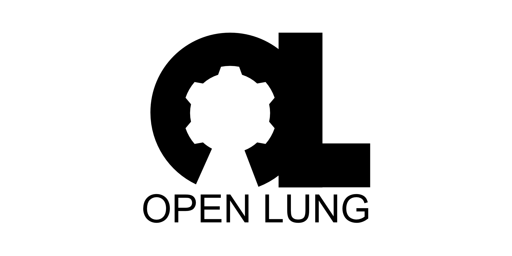

Ten dokument w innych językach:

<<<<<<< HEAD
|[english](README.md)|[català](README-ca.md)|[español](README-es.md)|[日本語](README-ja.md)|[汉语](README-zh-Hans.md)|[漢語](README-zh-Hant.md)|[português](README-pt_BR.md)|[nederlands](README-nl.md)|[Русский](README-ru.md)
|---|---|---|---|---|---|---|---|---|
=======
|[english](README.md)|[català](README-ca.md)|[français](README-fr.md)|[español](README-es.md)|[日本語](README-ja.md)|[汉语](README-zh-Hans.md)|[漢語](README-zh-Hant.md)|[português](README-pt_BR.md)|[nederlands](README-nl.md)|[Русский](README-ru.md)
|---|---|---|---|---|---|---|---|---|---|
>>>>>>> rmv-spec-add

jeśli chcesz pomóc w tłumaczeniu tej dokumentacji, kliknij [tutaj](https://gitlab.com/TrevorSmale/OSV-OpenLung/-/issues/23).

# Low Resource Bag Valve Mask (BVM) Ventilator

- This project was jumpstarted by the COVID-19 global pandemic as a result of community discussion on a facebook group called Open Source COVID19 and OpenSourceVentilator, this is why I created a GitLab project for a new open source product called **OpenLung**.
- More specifically in a discussion surrounding low cost **Bag Valve Mask** (**BVM** or **AmbuBag**) based emergency respirators wherein prior solutions had been developed. [The first from an MIT research group](https://web.mit.edu/2.75/projects/DMD_2010_Al_Husseini.pdf) comprising of the following persons (Abdul Mohsen Al Husseini, Heon Ju Lee, Justin Negrete, Stephen Powelson, Amelia Servi, Alexander Slocum and Jussi Saukkonen). [The second device from a Rice University Mechanical Engineering student group](http://oedk.rice.edu/Sys/PublicProfile/47585242/1063096) comprising of the following persons (Madison Nasteff, Carolina De Santiago, Aravind Sundaramraj, Natalie Dickman, Tim Nonet and Karen Vasquez Ruiz.
- This project seeks to combine and improve the efforts of these two projects into a more simple and reliable device that consists mostly of easy to source or 3D printed parts.
- Benefits: Can be mass produced, touch points use certified components, small and simple mechanical requirements, previous research and testing in this area, adaptable to both invasive tubing and masks.

*WARNING/DISCLAIMER: Whenever possible, please seek professional medical care with proper equipment setup by trained individuals. Do not use random information you found on the internet. We are not medical professionals, just people on the internet.*

# How To Join the Development
1. Fill out our Expression of Interest Form [here](https://opensourceventilator.ie/register) if you haven't already.
*This step is mandatory and it’s how we will find you to match your skills to areas you can help. If you have fabrication equipment, also fill out this form.*
2. We will reach out when your noted skills are needed, until then please check out the following:
-- Stay up to date with the project on our website [Open Source Ventilators Ireland](https://opensourceventilator.ie/) and our social channels.
-- Join our [Slack Channel](https://join.slack.com/t/osventilator/shared_invite/zt-cst4dhk7-BFNMz_vyBPthjlBFYV1yWA) to join the conversation. Many other side projects are happening there.
3. Get familiar with git by learning how to best contribute to this repository. There are many resources available online, you can start [here](https://www.youtube.com/watch?v=enMumwvLAug) or learn how to submit a merge request [here](https://docs.gitlab.com/ee/user/project/merge_requests/creating_merge_requests.html).
4. If you are anxious and would like to get developing, this is open source, please fork this repo and go for it!

# Project Requirements
- Project Requirements are listed [here](requirements/design-requirements.md).

# Project Progress

*Current Design Concept 6 with known issues*
