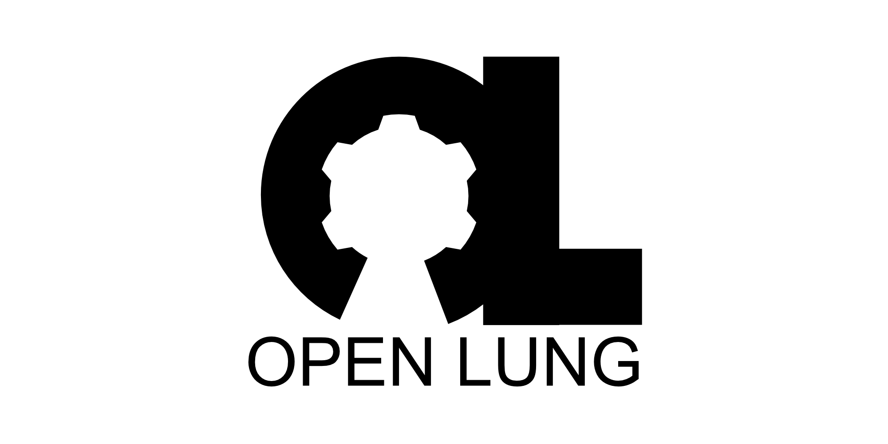

Diğer diller için:

<<<<<<< HEAD
<<<<<<< HEAD
|[english](README.md)|[català](README-ca.md)|[español](README-es.md)|[日本語](README-ja.md)|[汉语](README-zh-Hans.md)|[漢語](README-zh-Hant.md)|[português](README-pt_BR.md)|[nederlands](README-nl.md)|[Русский](README-ru.md)
|---|---|---|---|---|---|---|---|---|
=======
|[english](README.md)|[català](README-ca.md)|[français](README-fr.md)|[español](README-es.md)|[日本語](README-ja.md)|[汉语](README-zh-Hans.md)|[漢語](README-zh-Hant.md)|[português](README-pt_BR.md)|[nederlands](README-nl.md)|[Русский](README-ru.md)
|---|---|---|---|---|---|---|---|---|---|
>>>>>>> rmv-spec-add
=======
|[english](README.md)|[català](README-ca.md)|[deutsch](README-de.md)|[español](README-es.md)|[français](README-fr.md)|[日本語](README-ja.md)|[nederlands](README-nl.md)|[polski](README-pl.md)[português](README-pt_BR.md)|[Русский](README-ru.md)|[svenska](README-sv.md)|[türkçe](README-tr.md)[汉语](README-zh-Hans.md)|[漢語](README-zh-Hant.md)
|---|---|---|---|---|---|---|---|---|---|
>>>>>>> bf52a88a9998e2278d01b4d3f9af0c97cbe36c41

# Düşük  Gereksinimli  Torba/Bag Valf Maskesi (BVM) Solunum Destek Cihazı

- Bu proje Facebook'daki Open Source COVID19 ve OpenSourceVentilator gruplarındaki tartışmalardan sonra,  COVID-19 küresel salgınına karşı  başlatıldı. Bu tartışmaların sonunda  **OpenLung**  (AçıkAkciğer) isimli açık kaynak cihaz/ürün için bu GitLab projesini oluşturdum.
- Düşük maliyetli **Torba/Bag Valf Maskesi** (**BVM** veya  **AmbuBag** ) temelli acil durum solunum çihazlarının  (respiratörler) tartışıldıği   bir başlıkta, daha önceki çözümlerden bahsedildi. [Bunlardan ilki](https://web.mit.edu/2.75/projects/DMD_2010_Al_Husseini.pdf) MIT'deki bir araştırma grubu tarafından geliştirimiş.  Geliştiren kişiler: Abdul Mohsen Al Husseini, Heon Ju Lee, Justin Negrete, Stephen Powelson, Amelia Servi, Alexander Slocum and Jussi Saukkonen). [İkinci cihaz ](http://oedk.rice.edu/Sys/PublicProfile/47585242/1063096)   ise Rice Üniversitesi Makina Mühendisliği ögrenci grubu tarafından geliştirilmiş. Geliştiren kişiler: Madison Nasteff, Carolina De Santiago, Aravind Sundaramraj, Natalie Dickman, Tim Nonet and Karen Vasquez Ruiz.
- Bu proje, diğer iki projenin çabalarını birleştirip daha da geliştirerek, daha basit, daha güvenli, ve parçaları daha kolay bulunabilen veya 3D basılabilen bir cihaz ortaya çıkarmayı amaçlamaktadır.
- Getirileri: Seri üretilebilirlik, temaslı noktalarda sertifikalı parça kullanımı, basit ve küçük mekanik gereksinimler, bu alandaki önceki araştırma ve testlerden yararlanma, hem tüp boru hem maske desteği olması.

*UYARI/YASAL UYARI:   Lütfen mümkün olduğunca eğitimli ve uzman  kişiler tarafında kurulmuş, gerçek tıbbi aletleri kullanarak profesyonel tıbbi yardım alın. İnternette bulduğunuz rastgele bilgilere güvenmeyin ve o bilgileri  kullanmayın. Biz tıp uzmanı değiliz, sadece internetteki her hangi bir kişiyiz. *

# Projeye nasıl katılabilirsiniz?
1. Eğer henüz İlgi Belirtisi Formunu doldurmadıysanız  [buradan](https://opensourceventilator.ie/register) doldurun.
*Sizin yeteneklerinizle ihtiyaçlarımızı eşleştirebilmek için bu adım zorunludur. Eğer üretim yapabilecek imalat ekipmanınız varsa da bu formu doldurun.*
2. Yeteneklerinize ihtiyacımız olduğunda size ulaşacağız. O zamana kadar lütfen aşağıdaki maddeleri gerçekleştirin:
-- Websayfamızı ( [Open Source Ventilators Ireland](https://opensourceventilator.ie/) / Açık Kaynak Solunum Destek Cihazları İrlanda) ve sosyal medya kanallarımızı takip ederek projenin gelişimi hakkında güncel bilgileden haberdar olun.
--  [Slack kanalımıza](https://join.slack.com/t/osventilator/shared_invite/zt-cst4dhk7-BFNMz_vyBPthjlBFYV1yWA) gelerek sohbete katılın. Burada  bir çok başka yan projelerimizi de bulabilirsiniz.
3. Git'i kullaranak bu depoya en  iyi nasıl katkıda bulunacagınızı anlamak için git'i tanımaya çalışın. İnternette bu konuda bir çok kaynak bulabilirsiniz. Örnegin [buradan (İngilizce)](https://www.youtube.com/watch?v=enMumwvLAug)  veya [buradan (Türkçe)](https://www.youtube.com/watch?v=rWG70T7fePg&list=PLPrHLaayVkhnNstGIzQcxxnj6VYvsHBHy) başlayabilir,  [buradan (İngilizce)](https://docs.gitlab.com/ee/user/project/merge_requests/creating_merge_requests.html) katkılarınızı birleştirme isteğini (merge) nasıl göndereceğinizi öğrenebilirsiniz.
4. Eğer bir an önce kendiniz başlamak istiyorsanız, bu proje açık kaynak olduğu için tek yapmanız gereken  depoyu kopyalamanız  ve hemen üzerinde çalışmaya başlamanızdır.

# Proje Gereksinimleri
- Proje gereksinimlerine  [buradan (İngilizce)](requirements/design-requirements.md) erişebilirsiniz.

# Projenin Geçtiği Aşamalar

*Bilin sorunları olan 6. Güncel Tasarım Konsepti   *
