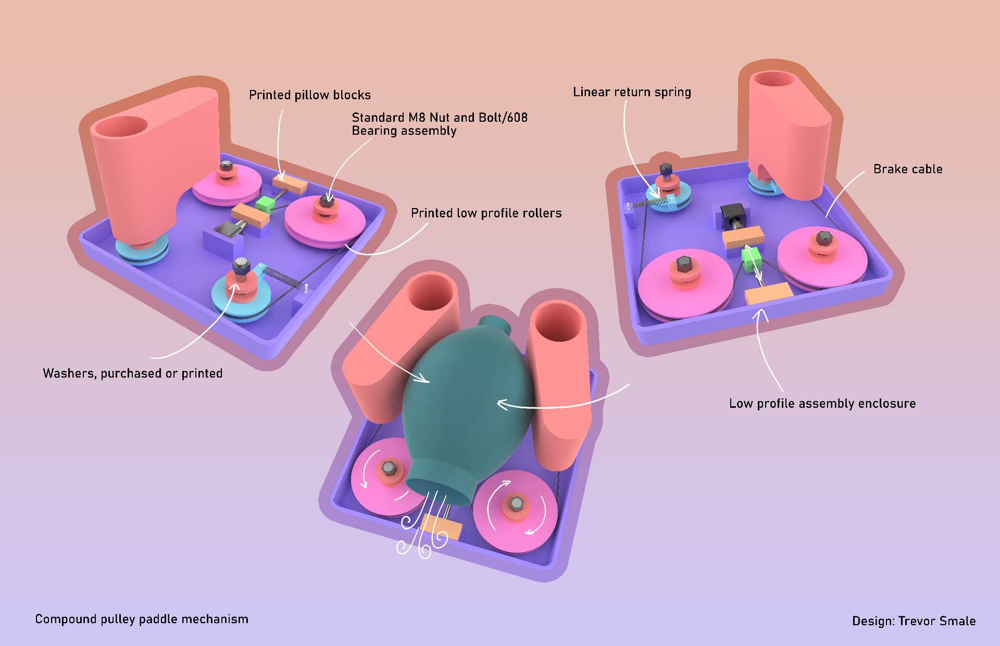

# Low resource Ambu-Bag ventilator

- This project was jumpstarted by the COVID-19 global pandemic as a result of community discussion on a facebook group called Open Source COVID19 and OpenSourceVentilator, this is why I created a GitLab project for a new open source product called **OpenLung**.
- More specifically in a discussion surrounding low cost **Bag Valve Mask** (**BVM** or **AmbuBag**) based emergency respirators wherein prior solutions had been developed. The first from an MIT research group comprising of the following persons (Abdul Mohsen Al Husseini1, Heon Ju Lee1, Justin Negrete, Stephen Powelson, Amelia Servi, Alexander Slocum and Jussi Saukkonen). The second device from a Rice University Mechanical Engineering student group comprising of the following persons (Madison Nasteff, Carolina De Santiago, Aravind Sundaramraj, Natalie Dickman, Tim Nonet and Karen Vasquez Ruiz. Photo by Jeff Fitlow).
- This project seeks to combine and improve the efforts of these two projects into a more simple and reliable device that consists mostly of 3D printed parts.

*WARNING/DISCLAIMER: Whenever possible, please seek professional medical care with proper equipment setup by trained individuals. Do not use random information you found on the internet. We are not medical professionals, just people on the internet.*

# Reasons for using an Ambu-Bag

- Mass Produced
- Certified components
- Small and Simple mechanical requirements
- Previous research and testing in this area
- Adaptable to both invasive tubing and masks

# Project Requirements
- Project Requirements are listed [here](Requirements.md).

# Project Progress

*Current Design concept with known issues, Version 5 is currently in the works.*

# TO-DO (Where we need help)

*If you can assist in these areas, please clone or fork this repo and create a merge request with your new/modified files.*

- Design a more integral 3D printed actuation mechanism
- Spec a good low amperage, high torque DC motor
- Design or find and H Bridge rectifier circuit
- Spec an interface (LCD and Buttons)
- Spec feedback sensors for PEEP, low voltage, high and low pressure events. Hi guys. I'm a physician and create new medical devices like robotics/prosthetic limbs. I was asked to share some thoughts on this project. It's great to see such an interest in helping!
- Outline interface visually

## IN PROGRESS (What we are working on today, March 17, 2020)

- Organization of Repository structure
- ~~Updated Ambu-Bag CAD model~~
- Interactivity outline
- Building communication bridge to the open source ventilator project Ireland
- Assessing current communication and deligation methods

## COMPLETED (What has been completed)

- ~~Design requirements~~

## Next iterative improvements

- Perpendicular Motor/Drive shaft connection due to axial load issues
- Simplify transmission struction
- Further compacting of overall build

